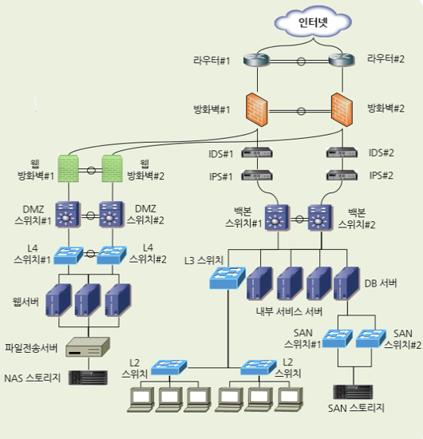

# TIL Template

## 날짜: 2025-02-06

### 스크럼

- 학습 목표 1 : 오전 강의 내용정리
- 학습 목표 2 : 네트워크 기본 구성도 찾아보고 이해하기
- 학습 목표 3 : 네트워크 실습 내용 정리하기

### 새로 배운 내용

#### 주제 1: 네트워크 보안

- 네트워크 보안의 **1차 목표**: 정보를 가진 시스템을 공격해 유출하거나 사용하지 못하게 하거나 시스템이 동작하지 못하게 해 정보 서비스를 정상적으로 구동할 수 없게 만드는 행위를 네트워크에서 적절히 막는 것
- 네트워크 보안의 **2차 목표**: 정보가 네트워크를 통해 복제, 이동되는 유출을 막는 것
- 네트워크 보안이 잘 갖춰져 있다면, 어플리케이션에 취약점이 있는 상태에서도 1차 방어선이 되어 공격을 방어할 수 있음

- `트러스트 네트워크`: 보호받아야 할 네트워크
- `언트러스트 네트워크`: 신뢰할 수 없는 외부 네트워크를
- 두 네트워크 사이에 방화벽 등의 보안조치를 함
- `DMZ 네트워크`: 운영하는 내부 네트워크이지만 신뢰할 수 없는 외부 사용자에게 개방해야하는 서비스 네트워크(일반적으로 인터넷에 공개되는 서비스를 배치)

  - `인터넷 시큐어 게이트웨이`: _트러스트 -> 언트러스트_ 네트워크로 통신을 통제
    ex) 방화벽, SWG, 웹 필터, 어플리케이션 컨트롤, 샌드박스와 같은 서비스나 네트워크 장비
  - `데이터 센터 시큐어 게이트웨이` : _언트러스트 -> 트러스트_ 네트워크로 통신을 통제
    ex) 방화벽, IPS, DCSG, WAF, Anti-DDoS 등의 장비

#### 주제 2: 네트워크 보안 장비
- DDoS 방어 장비
  - `트래픽 프로파일링 기법`을 주로 사용
    -> 네트워크 트래픽을 분석하여 특정한 네트워크 활동을 식별하는 기법
  - ISP나 네트워크 ISP와 연결되는 데이터 센터 네트워크의 가장 바깥쪽에 위치시켜 이 공격을 완화해야 함

- 방화벽<br>
-> 4계층에서 동작하는 패킷 필터링 장비
    - 일반적으로 DDoS 방어 장비 바로 뒤에 놓음
    - 3,4계층에서 동작하여 다른 보안 장비보다 비교적 간단히 동작하고 성능 우수
    - 패킷에서 5-튜블 조건을 참고함
        - 5-튜블: 3,4계층 헤더의 Source IP, Destination IP, Protocol No, Source Post, Destination Port
    - 헤더를 보고 판단하기 때문에 헤더를 조작하면 쉽게 공격할 수 있음. 그래서 현대에는 SPI 엔진을 사용한 방화벽을 사용함.
    
    ```
    * SPI 엔진
    -> 초기 방화벽은 패킷 필터를 사용하여 단순히 패킷이 조건이 맞는지만 확인했는데, 이렇게 하니까  불특정 다수와 통신할 때 정책관리가 힘들었음.(특히 통신의 양방향성을 인지못함)
    -> 따라서 요즘 방화벽에서는 SPI 엔진으로 통해 `상태 기반 패킷 검사` 기술을 사용.
        -> 패킷을 개별적으로 검사하는 대신 연결의 상태 정보를 유지하면서 패킷을 분석
    ```

- IPS, IDS
  <br>
  -> `IDS(침입 탐지 시스템)`: 방어보다 탐지에 초점을 맞추어 개발됨
  <br>
  -> `IPS(침입 방지 시스템)`: 공격이 발견되면 직접 차단하는 능력을 갖춘 장비
  - 최근에는 IDS와 IPS 장비를 구분하지 않고 IPS로 통칭
  - IDS와 IPS는 공격 데이터베이스를 제조사나 위협 인텔리전스 서비스 업체로부터 받음
  - 방화벽은 3,4계층에서만 방어가 가능하지만, IDS와 IPS는 3계층~7계층까지 방어 가능
  - **세션 이해 가능 여부**(회피 공격 차단을 위함), **어노말리**(능동적 방어를 위함) 등 가양한 기능으로 구분됨

- VPN
  <br>
  -> 가상 네트워크를 만들어주는 장비로 공통 네트워크를 통해 데이터를 주고 받으면서도 안전하게 통신할 수 있게 함.
  - `암호화`와 `터널링 기술`을 사용
  - 본사 - 지사 네트워크 연결 -> IPSEC VPN 기술 사용 
    - 네트워크 간 연결은 보안이 강력한 IPSEC 기반의 VPN 기술 사용
    - 따라서 본사와 지사 모두 IPSEC VPN 기능을 지원하는 네트워크 장비가 필요
  - 개인사용자 - 본사 -> SSL VPN 기술 사용

  - `IPSEC VPN`: IP 계층(**네트워크 계층**)에서 동작하며, 모든 네트워크 트래픽을 암호화하고 보호
  - `SSL VPN`:  TLS/SSL 계층(**어플리케이션 계층**)에서 동작하며, 웹 브라우저 기반으로 특정 어플리케이션 트래픽을 보호


#### 주제 2: 네트워크 구성도 (기본적인 구성도 예시)
ex) isp 회선 -> 방화벽 또는 UTM -> 백본(스위치) -> L2<br>
ex) isp 회선 -> L3 -> 방화벽 -> IPS -> 백본(스위치) -> 내부 zone<br>
ex) isp 회선 -> 라우터 -> ddos -> ips -> 방화벽 -> dmz -> L4 -> 웹 방화벽<br>


### 오늘의 도전 과제와 해결 방법

- 도전 과제 1: 패킷트레이서 실습 내용 정리 - 코드까지 포함시키기

### 오늘의 회고

- 실습 정리한걸 다시 보면서 패킷트레이서를 사용하려는데 너무 짧게 정리해서 알아볼 수가 없었다. 그래서 적절한 예시와 함께 코드를 넣어 정리본만으로 작업을 수행할 수 있게 다시 정리하였다. 이 과정에서 명령어를 한 번씩 더 익힐 수 있어 좋았지만 시간이 꽤 허비된 것 같다.
<br>
또 강의에서 VPN과 관련된 내용이나 방화벽 실습에 대한 내용은 진행하지 않아, 그것부터 끝내고 과제를 수행한다고 과제를 하나도 하지 못했다. 내일 딥다이브 시간에는 칼리리눅스로 공격 방법이나 방어 방법을 익힌다는데 그러면 과제를 제대로 수행할 시간이 부족할 것 같다.
<br>
한 번 공부할 때 더 집중해서 시간을 아끼던가 주말에 좀 더 열심히 하거나 해야겠다.

### 참고 자료 및 링크
네트워크 구성도 그리기 참고링크
1) 일반적인 네트워크 구성도 참고
https://www.sharedit.co.kr/qnaboards/26536
2) 인하대학교 네트워크 구성도
https://cic.inha.ac.kr/cic/11096/subview.do
3) 복잡한 사내망 구성도 참고
https://www.2cpu.co.kr/bbs/board.php?bo_table=QnA&wr_id=639786